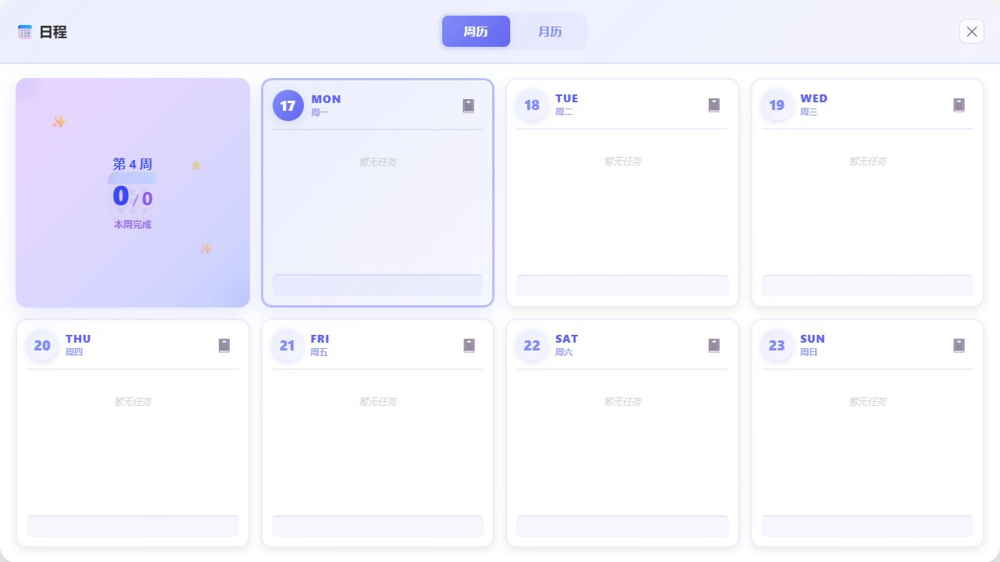
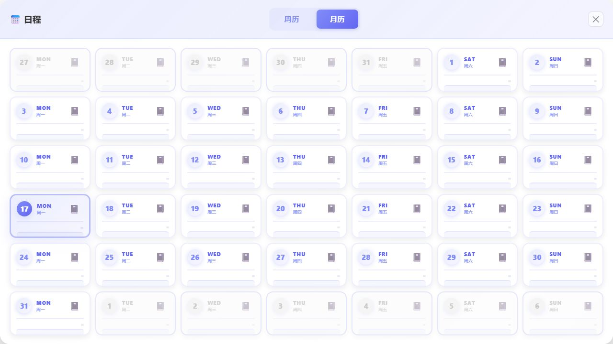

# YamList / 山药List

> A jelly-glass, themeable desktop workspace for tasks, notes, and gentle daily planning.

YamList 是一款面向 Windows 的桌面任务、日程与便笺应用。它把果冻质感的半透明面板、毛玻璃层次、柔和渐变和可切换主题带到待办工具里，再把周历、日记和心情签名收进一个可常驻桌面边缘的小窗口。无需登录，个人数据默认保存在本机。


## 视觉预览

### 桌面任务板

<p align="center">
  
</p>

主界面展示了 YamList 的核心视觉：半透明毛玻璃任务区、柔和渐变标题栏、果冻卡片、彩色标签栏和海面背景。小尺寸窗口可以放在桌面边缘，集中展示任务、进度、标签、心情签名和常用操作。

### 周历



### 月历



## 颜值是第一功能

YamList 不想做成一张冷冰冰的任务表，而是一个愿意长期放在桌面上的小工作台。

- **Jelly UI**：圆润的果冻卡片、半透明层叠和轻盈阴影，让任务状态更容易被扫读
- **Frosted glass**：毛玻璃面板叠加背景图，保留空间感，同时维持文字和控件的可读性
- **Themeable**：主题预设、自定义主色、任务区颜色、透明度和背景图可以自由组合
- **Mood-first**：顶部心情签名和日期让每天打开应用时都有一点个人温度

## 为什么做 YamList

很多待办工具需要账户、订阅或浏览器标签页。YamList 更偏向一个随手可见的桌面工作台：启动后即可记录，锁定后可以降低干扰，需要回顾时再打开日历和统计。

- **离线优先**：核心功能不依赖账户、云同步或网络服务
- **桌面常驻**：无边框窗口、系统托盘、置顶与锁定穿透模式
- **快速整理**：用状态、进度、重复规则和自定义标签组织任务
- **日程回顾**：周历、月历和按日期记录的日记放在同一应用中
- **个人化显示**：主题预设、自定义配色、背景图、透明度和窗口尺寸

## 主要功能

### 任务与清单

- 新建、编辑、完成、删除和搜索任务
- 进度、置顶、备注、截止日期和重复任务
- 全部、已完成、重复、逾期及自定义标签视图
- 统计概览与逾期状态高亮

### 日历与记录

- 独立周历和月历窗口
- 按日期查看任务
- 每日便笺/日记与心情签名

### 桌面体验

- 系统托盘与全局快捷键
- 窗口置顶、锁定穿透和尺寸调整
- 果冻风格、毛玻璃层次、多套主题、自定义颜色、透明度和背景图
- 简体中文、繁体中文、英语、日语等 12 种界面语言

### 数据管理

- JSON / Excel 数据导入，JSON / TXT 数据导出
- 任务、日记、标签和偏好设置默认保存在本机
- 主进程包含 SQLite 数据层，便于后续统一持久化和迁移

## 从源码运行

环境要求：Windows 10/11、Node.js 18+、npm 9+。

```bash
git clone https://github.com/qqqq8312496/yamlist.git
cd yamlist
npm install
npx electron-rebuild -f -w better-sqlite3
npm run dev
```

`better-sqlite3` 是原生模块。切换 Node.js 或 Electron 版本后，请重新执行 `electron-rebuild`。

## 构建

构建前端资源：

```bash
npm run build
```

生成 Windows x64 安装包和便携版：

```bash
npm run build:win64
```

构建产物会写入 `dist/`。当前打包流程主要面向 Windows，macOS 与 Linux 尚未验证。

## 数据与隐私

YamList 不包含登录、云同步或遥测模块。任务、日记、标签和偏好设置保存在 Electron 的本地用户数据目录；仓库通过 `.gitignore` 排除数据库、日志、环境变量和本地配置。

截图使用的是通用演示数据，公开仓库不包含开发者的个人任务、联系方式、访问令牌或本地路径。

## 技术栈

- Electron 28
- React 18 + TypeScript 5
- Zustand
- SQLite / better-sqlite3
- Vite + electron-builder

## 项目结构

```text
src/                 React 界面、状态管理和业务组件
electron/            主进程、SQLite、托盘、快捷键和窗口管理
assets/icons/        应用图标
build/               Windows 安装包脚本
docs/screenshots/    README 演示截图
```

## 贡献

欢迎提交 Issue 和 Pull Request。涉及数据格式、数据库或主进程 IPC 的改动，请在 PR 中说明迁移方式和手工验证步骤。

## 许可证

本项目使用 [MIT License](LICENSE)。
